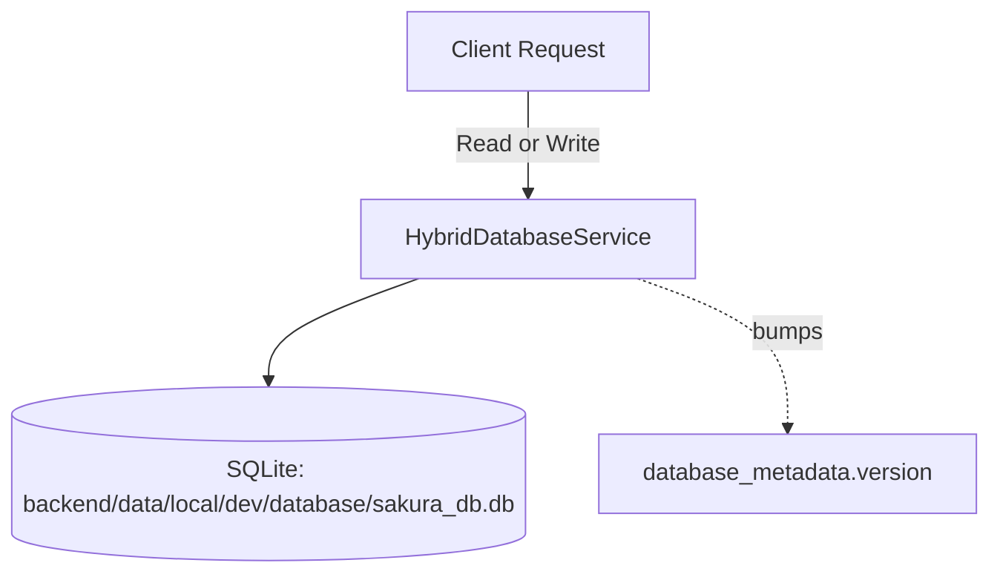

# Backend AI Agent Guide - Flask Codebase

Welcome, AI Agent! This guide details the backend architecture of the Sakura Python Flask codebase.

> **Important:** Sakura runs in **local-only mode**. The remote/Git database
> sync layer (formerly `git_database_service`, `git_file_storage`,
> `sync_database_service`, `storage_providers`, etc.) has been **deleted**.
> All reads and writes hit a single SQLite file under
> `backend/data/local/dev/database/sakura_db.db`. Do **not** reintroduce a
> remote DB, a `storage:` config block, or a `data/remote/` directory.

---

## 1. Directory Structure

The backend application is written in Python and uses a layered domain-driven design:

- [`main.py`](file:///c:/workspace/sources/Simple/backend/main.py): Entry point. Configures Flask, registers blueprints, provisions the master admin account, and initializes the local-only `HybridDatabaseService`.
- [`src/controllers/`](file:///c:/workspace/sources/Simple/backend/src/controllers/): Blueprints handling HTTP routing, request parsing, and error mapping (`auth_controller.py`, `user_controller.py`, `test_case_controller.py`, `requirement_controller.py`, `design_ticket_controller.py`, `spec_controller.py`, `admin_controller.py`, `parsing_controller.py`).
- [`src/services/`](file:///c:/workspace/sources/Simple/backend/src/services/): Business logic.
  - `hybrid_database_service.py`: Thin local-only wrapper around `LocalDatabaseService`. Kept under the original name for backwards compatibility with consumers.
  - `local_database_service.py`: Raw SQLite queries, caching, metadata versioning, and user preferences.
  - Entity services: `user_service.py`, `requirement_service.py`, `test_case_service.py`, `design_ticket_service.py`, `spec_service.py`, `parsing_service.py`.
- [`src/repositories/`](file:///c:/workspace/sources/Simple/backend/src/repositories/): Data-access layers (`user_repository.py`, `test_case_repository.py`).
- [`src/infrastructure/`](file:///c:/workspace/sources/Simple/backend/src/infrastructure/):
  - `dependency_injection.py`: Manual DI container with getter functions.
  - `network_restrictor.py`: Restricts outbound network connections to loopback only.
  - `configuration_manager.py`: Parses YAML/JSON configuration.
- [`src/middleware/`](file:///c:/workspace/sources/Simple/backend/src/middleware/): CORS, request logging, validation, JWT auth.

---

## 2. Database Pipeline (Local-Only)

- **SELECT queries** are routed to the local SQLite database via `LocalDatabaseService`.
- **WRITE queries** (INSERT/UPDATE/DELETE) execute against SQLite, then bump the `database_metadata.version` row and invalidate the local query cache. There is no remote mirror, no commit, and no push.
- `HybridDatabaseService.get_sync_status()` returns `{"mode": "local-only", "remote_sync_enabled": false}` so any old client still polling `/api/sync/status` gets a clear answer.

Legacy endpoints `/api/databases`, `/api/databases/<n>/info`, `/api/databases/<n>/sync`, `/api/databases/<n>/query`, `/api/git/status`, `/api/git/pull`, `/api/sync/force` now respond **HTTP 410 Gone** with an explanation that remote sync was removed.

---

## 3. Network Restrictor (Sandbox Security)

[`src/infrastructure/network_restrictor.py`](file:///c:/workspace/sources/Simple/backend/src/infrastructure/network_restrictor.py) monkey-patches `socket.socket.connect`. Allow-list: `localhost`, `127.0.0.1`, `::1` only. There is no scenario in which the backend should be reaching out to gitlab.com, github.com, or any other external host.

---

## 4. Coding Conventions for Backend Development

1. **Dependency Injection:** Always retrieve services via the getters in [`dependency_injection.py`](file:///c:/workspace/sources/Simple/backend/src/infrastructure/dependency_injection.py); never instantiate them inside controllers/services.
2. **Logging:** Use `src.infrastructure.logging_config.get_logger(__name__)` for loggers.
3. **SQL Injection Protection:** Always pass parameterized tuples (`params=`) to execution methods. Never interpolate user input into SQL strings.
4. **Local-Only Invariant:** If you find yourself adding `git`, `remote`, `sync`, `clone`, `push`, or `commit` to a database code path, stop and rethink. The local-only invariant is intentional.
