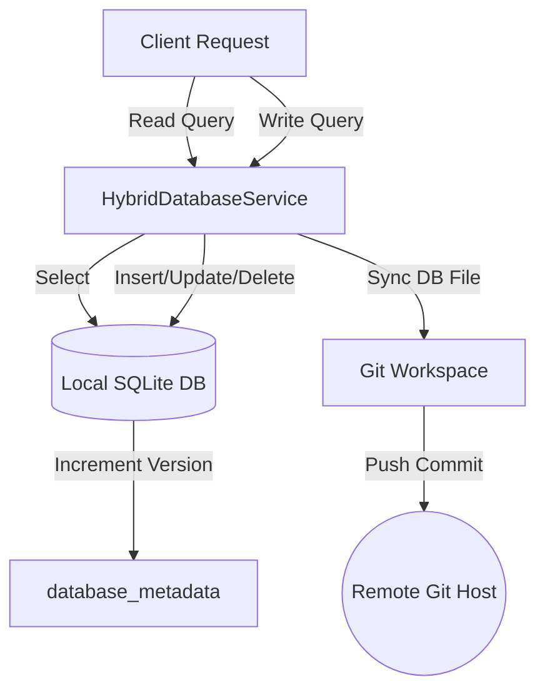

# Backend AI Agent Guide - Flask Codebase

Welcome, AI Agent! This guide details the backend architecture of the Sakura Python Flask codebase. Read this to understand directories, services, and the hybrid storage synchronization pipeline.

---

## 1. Directory Structure

The backend application is written in Python and uses a layered domain-driven design:

- [`main.py`](file:///c:/workspace/sources/Simple/backend/main.py): Entry point. Configures Flask, registers blueprints, provisions the master admin account, and initializes the hybrid database sync.
- [`src/controllers/`](file:///c:/workspace/sources/Simple/backend/src/controllers/): Blueprints handling HTTP routing, request parsing, and error mapping:
  - `auth_controller.py`, `user_controller.py`, `test_case_controller.py`, `requirement_controller.py`, `design_ticket_controller.py`, `spec_controller.py`, `admin_controller.py`.
- [`src/services/`](file:///c:/workspace/sources/Simple/backend/src/services/): Implements business logic. This is the core logical layer.
  - `hybrid_database_service.py`: Orchestrates queries and file sync between local and Git-based databases.
  - `git_database_service.py`: Manages SQLite file pushes, pulls, commits, and user token access.
  - `local_database_service.py`: Handles raw SQLite queries, caching, metadata versioning, and user preferences.
  - Entity services: `user_service.py`, `requirement_service.py`, `test_case_service.py`, `design_ticket_service.py`, `spec_service.py`.
- [`src/repositories/`](file:///c:/workspace/sources/Simple/backend/src/repositories/): Data access layers mapping raw SQL query dictionaries to objects (`user_repository.py`, `test_case_repository.py`).
- [`src/infrastructure/`](file:///c:/workspace/sources/Simple/backend/src/infrastructure/):
  - `dependency_injection.py`: Implements manual dependency injection using getter functions.
  - `network_restrictor.py`: Restricts outbound network connections.
  - `configuration_manager.py`: Parses JSON configurations from the project config path.
- [`src/middleware/`](file:///c:/workspace/sources/Simple/backend/src/middleware/): Cors setup, loggers, validation checks, and JWT authentication filters.

---

## 2. The Hybrid Database Sync Pipeline

Sakura maintains local cache state while persisting data persistently in a remote Git repository.

### A. Initialization & Startup Sync
On startup, `HybridDatabaseService.initialize()`:
1. Calls `remote_db.git_storage.clone_or_fetch_repo()` to ensure the remote workspace exists.
2. Compares the SQLite version header metadata in `database_metadata` between the local database and the remote SQLite database located in `database/sakura_db.db`:
   - If **`local_version > remote_version`**, it copies the local SQLite file to the remote workspace and commits it to Git.
   - If **`local_version < remote_version`**, it copies the remote SQLite file to overwrite the local cache database.
   - If versions match, it checks the file timestamps (`st_mtime`) to handle same-version writing disputes.
3. Starts a daemon background thread executing `_sync_worker` to regularly check for remote updates.

### B. Query Execution Strategies
- **SELECT Queries:** Routed straight to the local SQLite database.
- **WRITE Queries (INSERT, UPDATE, DELETE):**
  1. Checks if the remote database version is newer than the local database. If it is, the remote database is copied over first.
  2. Executes the query on the local SQLite database.
  3. Increments the SQLite `database_metadata` version value.
  4. Copies the updated `local.db`/`sakura_db.db` file into the Git repository folder.
  5. Commits and pushes the update with a dynamically generated commit message (e.g. `Add user: testuser1`) using `remote_db.commit_changes(...)`.

---

## 3. Network Restrictor (Sandbox Security)

The application enforces strict network isolation:
- [`src/infrastructure/network_restrictor.py`](file:///c:/workspace/sources/Simple/backend/src/infrastructure/network_restrictor.py) monkey-patches `socket.socket.connect` during module import.
- Allowed connections: `localhost` and loopbacks (`127.0.0.1`, `::1`) only. Remote/git DB sync is permanently disabled across all environments, so no external hosts are whitelisted.
- Any attempt to reach any external domain (e.g. `gitlab.com`, `www.google.com`) will raise a `ConnectionRefusedError`.

---

## 4. Coding Conventions for Backend Development

1. **Dependency Injection:** Avoid instantiating services or databases directly inside controllers or services. Always retrieve them via functions in [`dependency_injection.py`](file:///c:/workspace/sources/Simple/backend/src/infrastructure/dependency_injection.py).
2. **Commit with Tokens:** When syncing writes to Git, attempt to decrypt the user's base64-encoded token stored in the `git_token_encrypted` column of the `users` table, passing it to `commit_changes` to track the actual author of changes.
3. **Log Actions:** Use `src.infrastructure.logging_config` to get loggers and output connection states, queries, and failures.
4. **SQL Injection Protection:** Always pass parameterized tuples to the database execution methods (`params` argument) rather than string interpolation.
